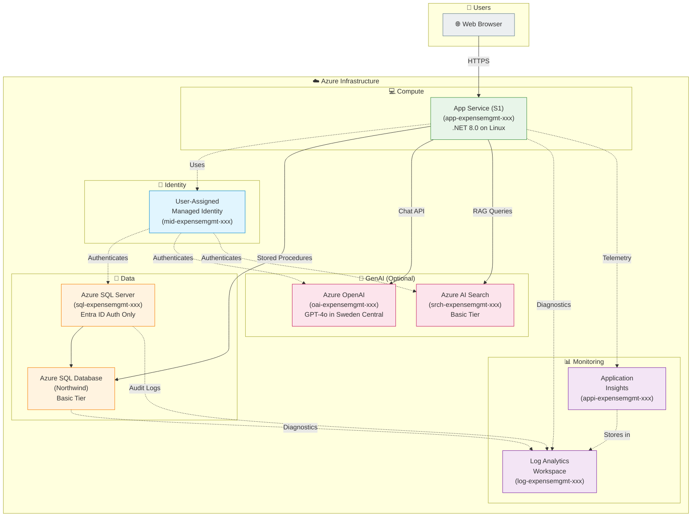

# Azure Services Architecture Diagram

This document provides a visual overview of the Azure services deployed by this repository and how they connect to each other.

## High-Level Architecture



## Component Details

### Core Infrastructure (Always Deployed)

| Component | Azure Service | Purpose |
|-----------|--------------|---------|
| **Managed Identity** | User-Assigned Managed Identity | Passwordless authentication between Azure services |
| **Web App** | App Service (S1 Linux) | Hosts the ASP.NET 8.0 Razor Pages application |
| **SQL Server** | Azure SQL Server | Database server with Entra ID authentication only |
| **Database** | Azure SQL Database (Basic) | Stores expense data, users, categories, statuses |
| **Log Analytics** | Log Analytics Workspace | Centralized log collection and analysis |
| **App Insights** | Application Insights | Application performance monitoring |

### GenAI Components (Optional - deploy with `deployGenAI=true`)

| Component | Azure Service | Purpose |
|-----------|--------------|---------|
| **OpenAI** | Azure OpenAI (S0) | GPT-4o model for natural language chat interface |
| **AI Search** | Azure AI Search (Basic) | RAG pattern support for contextual responses |

## Connection Types

| Connection | Authentication Method |
|------------|----------------------|
| App → SQL | Managed Identity (Active Directory Managed Identity) |
| App → OpenAI | Managed Identity (Cognitive Services OpenAI User role) |
| App → AI Search | Managed Identity (Search Index Data Contributor role) |
| User → App | HTTPS (public endpoint) |
| Resources → Log Analytics | Azure Diagnostic Settings |

## Data Flow

### Standard Request Flow
```
User Browser → App Service → SQL Database (via Stored Procedures) → Response
```

### AI Chat Flow (when GenAI deployed)
```
User Browser → App Service → Azure OpenAI (Function Calling) → App Service → SQL Database → Azure OpenAI → Response
```

### Monitoring Flow
```
App Service Logs → Log Analytics Workspace
SQL Server Audit → Log Analytics Workspace
SQL Database Metrics → Log Analytics Workspace
App Telemetry → Application Insights → Log Analytics Workspace
```

## Security Features

1. **No SQL Passwords**: Entra ID authentication only (`azureADOnlyAuthentication: true`)
2. **Managed Identity**: All service-to-service auth uses passwordless managed identity
3. **HTTPS Only**: App Service configured with `httpsOnly: true`
4. **TLS 1.2 Minimum**: Both App Service and SQL Server enforce TLS 1.2+
5. **FTPS Disabled**: App Service file transfer disabled for security

## Regions

| Resource | Region | Reason |
|----------|--------|--------|
| Most Resources | UK South | Primary deployment region |
| Azure OpenAI | Sweden Central | GPT-4o model availability and quota |

## Resource Naming Convention

All resources follow this pattern: `{prefix}-{baseName}-{uniqueSuffix}`

- `{prefix}`: Resource type abbreviation (app, sql, mid, log, appi, oai, srch)
- `{baseName}`: Base name parameter (default: expensemgmt)
- `{uniqueSuffix}`: Generated from `uniqueString(resourceGroup().id)` for deterministic uniqueness
